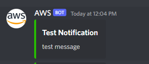
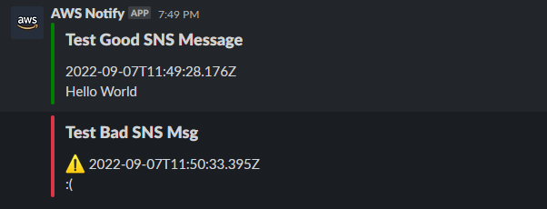

# AWS Notification Lambda

A simple lambda function to send a notification to Discord or Slack. Also works with SNS, in which case `webhookUrl` and `statusCode` would be MessageAttributes.

## Discord



### Deploy

```
create_function.sh notify_discord
```

### Update

```
update_function.sh notify_discord
```

### Usage

1. Generate a [basic execution lambda role](https://docs.aws.amazon.com/lambda/latest/dg/lambda-intro-execution-role.html) and set the `ROLE_ARN` environment variable to it.
2. Generate a [Discord webhook URL](https://support.discord.com/hc/en-us/articles/228383668-Intro-to-Webhooks). Payload `webhookUrl` should correspond to the webhook URL to post the message to the right channel.
3. Assuming you have aws config and credentials set up, run `bash create_function.sh notify_discord` to deploy the function.
4. You can send a payload with 3 fields (`statusCode`, `title`, `body`) - If `statusCode` (optional) is not 200, a red colored message is sent with a warning sign.

## Slack



### Deploy

```
create_function.sh notify_slack
```

### Update

```
update_function.sh notify_slack
```

### Usage

1. Generate a [basic execution lambda role](https://docs.aws.amazon.com/lambda/latest/dg/lambda-intro-execution-role.html) and set the `ROLE_ARN` environment variable to it.
2. Generate a [Slack webhook URL](https://api.slack.com/messaging/webhooks). Payload `webhookUrl` should correspond to the webhook URL to post the message to the right channel.
3. Assuming you have aws config and credentials set up, run `bash create_function.sh notify_discord` to deploy the function.
4. You can send a payload with 3 fields (`statusCode`, `title`, `body`) - If `statusCode` (optional) is not 200, a red colored message is sent with a warning sign. `body` accepts markdown.
