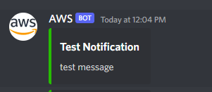

# Discord Notification Lambda

Just a simple lambda function to send a notification to Discord.

## Usage

1. Generate a [basic execution lambda role](https://docs.aws.amazon.com/lambda/latest/dg/lambda-intro-execution-role.html) and set the `ROLE_ARN` environment variable to it.
2. Generate a [Discord webhook URL](https://support.discord.com/hc/en-us/articles/228383668-Intro-to-Webhooks) and assign it to the `WEBHOOK_URL` environment variable.
3. Assuming you have aws config and credentials set up, run `bash create_function.sh notify_discord` to deploy the function
4. You can send a payload with 3 fields (`statusCode`, `title`, `body`) - If `statusCode` is not 200, a red colored message is sent with a warning sign.

